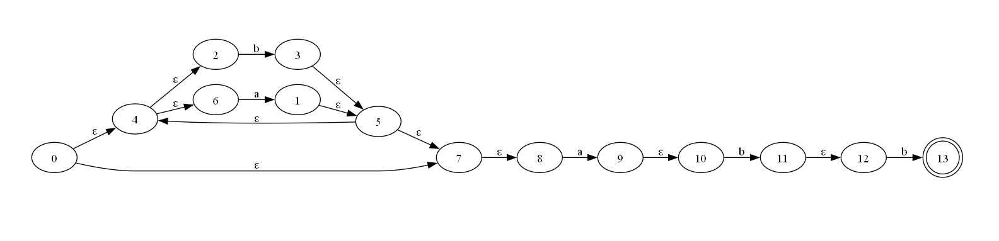

# 实验二 词法分析程序

## 运行说明

```shell
# 如果没有安装 pipenv
pip install pipenv
# 进入项目的虚拟环境
pipenv shell
# 启动图形界面
python main.py
```
- 如果报错，添加 [Graphviz](https://graphviz.org/download/) 环境变量后 **重启**

## 数据输入输出格式

### 输入：正则表达式
- 闭包运算符（*）、连接符（.）、运算符（|）和括号
  - 运算符的优先级依次递减
  - 连接符（.）可省略 
- e.g. `(a|b)*abb`   

### 输出：终端 + 图形界面

- **终端**
  - 输入正则表达式从中缀式到后缀式的转化
  - 对应 NFA 图形的点边关系列表
  - 确定自动机 DFA 图形的点边关系列表
  - 最小化 DFA 图形的点边关系列表
- **图形界面**
  - 输入正则表达式对应的 NFA 图形
  - 确定自动机 DFA 的图形
  - 最小化 DFA 的图形

- **点边关系列表示例**

```python
# 此示例为 (a|b)*abb 的 NFA 点边列表
# 定义节点列表：（索引号，点名称，初态标记，终态标记）
nodes = [(0, '0', 'begin', ''), (1, '1', '', ''), (2, '2', '', ''), (3, '3', '', ''),
    (4, '4', '', ''), (5, '5', '', ''), (6, '6', '', ''), (7, '7', '', ''),
    (8, '8', '', ''), (9, '9', '', ''), (10, '10', '', ''), (11, '11', '', ''), 
    (12, '12', '', ''), (13, '13', '', 'end')]
# 定义边列表：（起点索引号，终点索引号，边名称）
edges = [(6, 1, 'a'), (1, 5, 'ε'), (2, 3, 'b'), (3, 5, 'ε'), 
    (4, 2, 'ε'), (4, 6, 'ε'), (5, 4, 'ε'), (5, 7, 'ε'), (0, 4, 'ε'), 
    (0, 7, 'ε'), (7, 8, 'ε'), (8, 9, 'a'), (9, 10, 'ε'), (10, 11, 'b'), 
    (11, 12, 'ε'), (12, 13, 'b')]
```
- 
## 参考资料

- [编译原理实验——正则表达式转化为 NFA](https://blog.csdn.net/weixin_45925418/article/details/118057014)
- [基于MYT算法和自顶向下算法从正则表达式到 NFA](https://blog.csdn.net/qq_30225253/article/details/105261456)